***Network Address Translation***

Video Link: <https://youtu.be/IuPzyZuIJqQ>

Implementation for this project involved two machines: Windows 11
(client) and an Ubuntu machine (NAT/server). This project leverages
muli-threading and scapy to enable us to tunnel traffic to and from our
internal client with the outside world for both TCP and UDP traffic. The
following is an overview of the environment setup:

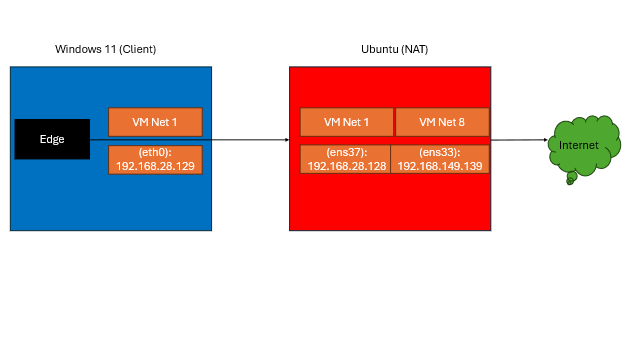

And our updated illustration of how our script interacts with scapy and
the aforementioned interfaces:

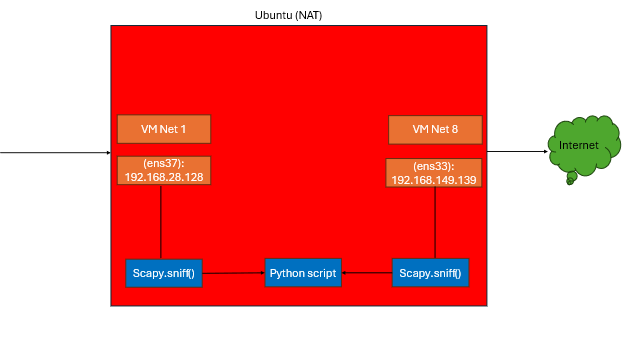

The basis of our script is four concurrent threads, two for UDP
(client/server) and two for TCP (client/server):

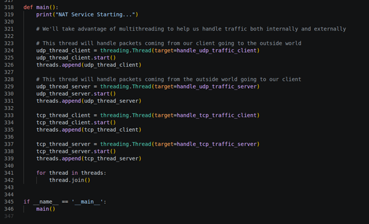

We can see each client/server function is fitted with the appropriate
function call which blocks with a sniff call to scapy:

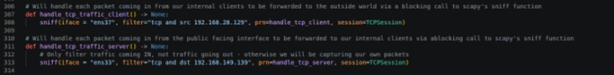

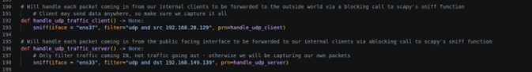

Each client function is fitted with a filter to filter only that traffic
that has a source address of 192.168.28.129 (our client IP address).
Each server function is fitted with a filter to filter only that traffic
that has a destination address of 192.168.149.139 (our server public
facing IP address). Each has a callback to an appropriate client/server
handling function. First UDP implementation of callbacks:

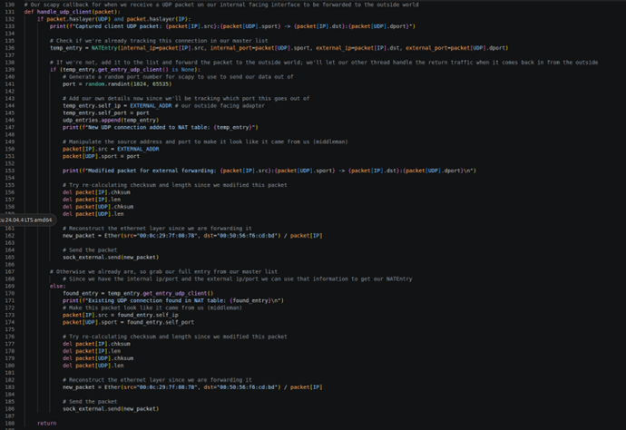

We can see with our client callback we perform some simple checks to
validate the packet is UDP, create a NAT table entry with the provided
information (client ip/port and destination ip/port) and check if this
entry already exists within our UDP table. If it does, we simply alter
the source ip/port, remove checksums + lengths so scapy can recalculate
them for us, and finally modify our ethernet layer with the correct MAC
addresses before forwarding our packet outwards. We also randomly select
a port for our NAT server to use to forward traffic from here onwards.
For the server callback implementation:

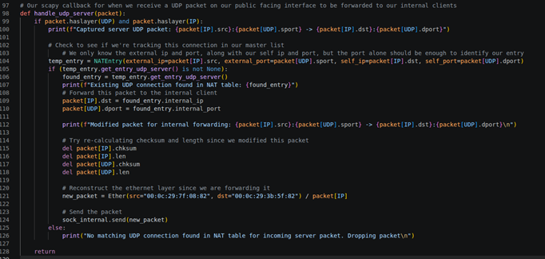

For our server, we are concerned with those packets coming in from the
public internet that are meant for our internal client. We perform many
of the same checks, change our destination ip/port for our client,
checksum/length modifications, and our ethernet layer modifications
before sending the packet off to the client. Here we assume we should
already be tracking this connection via our NAT table, otherwise we
ignore the packet if we don’t find it.

Looking towards our TCP client callback:

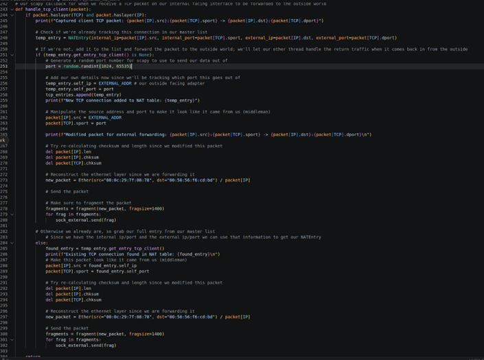

We see again many of the same checks, creation of our NAT table entry,
modification of headers and forwarding of packet to the public internet.
The largest change here from UDP would be the addition of fragmentation
so we don’t receive an error from the OS when sending large data
segments. For our TCP server implementation:

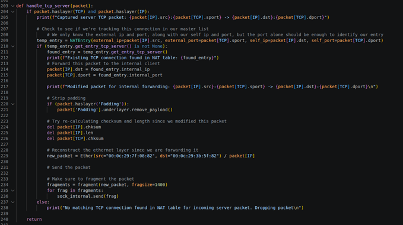

Many of the same implementations, with the caveat that we must remove
any padding since Windows will identify these bytes as payload bytes,
breaking our TCP connection.

From here we can investigate our NATEntry class, which serves to be a
NAT table entry for each existing connection between our client and the
outside world:

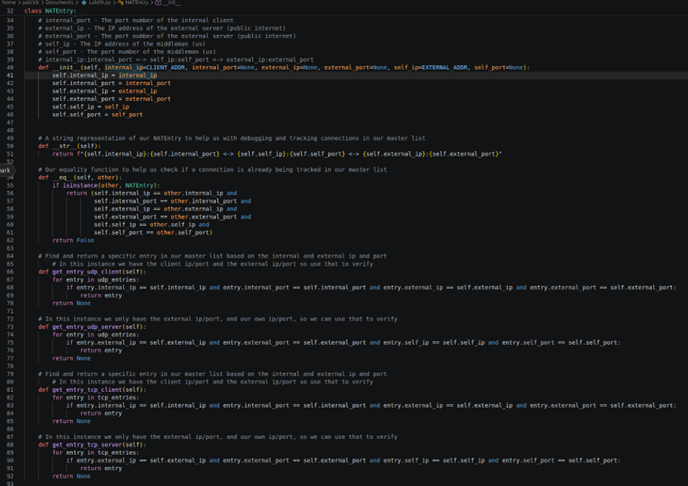

For our class, we can see our 6 fields that make a NAT table entry:

  - Internal\_ip – ip address of our windows client

  - Internal port – port our packet is coming from from our windows
    client

  - External ip – ip address of the destination windows is trying to
    reach

  - External port – port of the destination windows is trying to reach

  - Self ip – ip address of the NAT server (us)

  - Self port – random port we chose to forward traffic out of (NAT
    server)

Additionally, we see some helper functions, and getter functions for
helping us identify whether or not a TCP/UDP client/server entry is in
our NAT table when we receive a packet. If it is, we use the previous
port to send traffic to the corresponding side.

Finally, some of our globals:

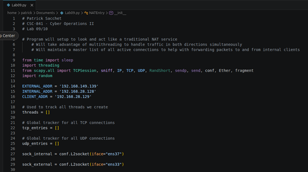

  - Threads – list of our running threads to wait on

  - Tcp\_entries – NAT table for tcp connections b/w client/server

  - Udp\_entries – NAT table for udp connections b/w client/server

  - Sock\_internal – L2 socket to use for forwarding traffic into our
    network

  - Sock\_external – L2 socket to use for forwarding traffic out of our
    network

Sample pcap screenshots, first of TCP tested via a curl from our windows
machine to <http://google.com:80>:

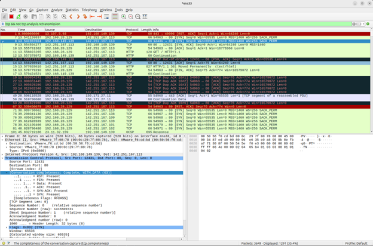

And the corresponding packets on our Windows client:

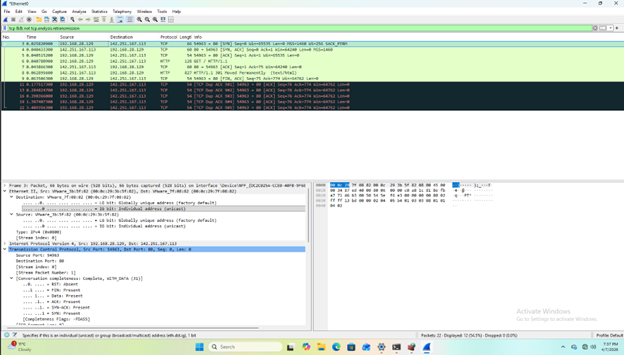

We can see on our NAT server both a packet from .129 (our client) but
then also see immediately after receiving the packet our forwarding of
the packet on .139.

Output of curl command:

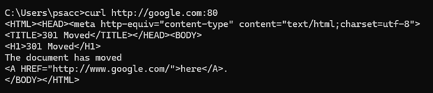

Packet capture of UDP test, completed via a nslookup of google.com from
our windows client:

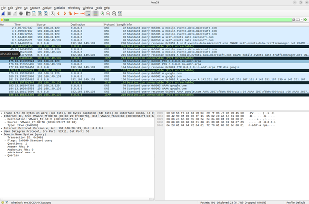

Packet capture of UDP test from Windows client:

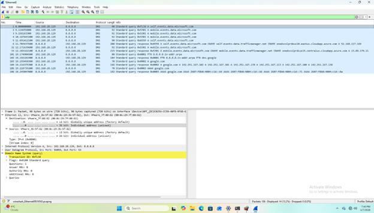

Again, we see the repeated receipt of a packet from our .129 address to
be immediately followed by our .139 forward. Output of our nslookup
command from our windows client:

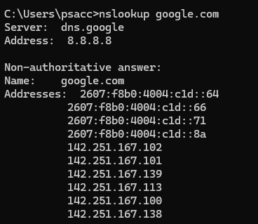

Additional considerations:

  - All firewall settings were disabled in the Windows machine to help
    ensure no issues were encountered when forwarding traffic to the
    client

  - An iptables rule was used to prevent the ubuntu OS from sending RST
    packets to servers we were forwarding traffic to. This is because
    technically we are acting like a socket ourselves, not asking the OS
    to explicitly track sockets for us

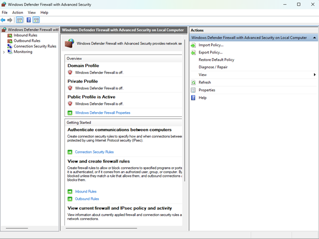

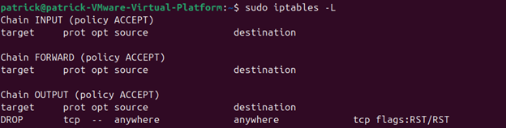

Sample program output:

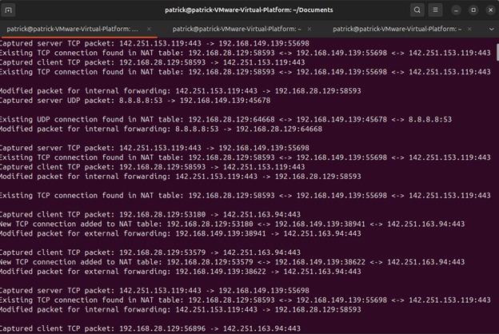
